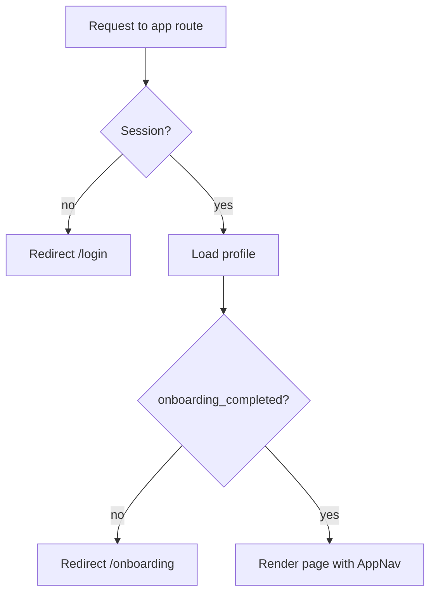

# TasteTailor MVP Implementation Plan

Source of truth: [PRD.md](./PRD.md), [ARCHITECTURE.md](./ARCHITECTURE.md), [TECHNICAL_DESIGN.md](./TECHNICAL_DESIGN.md).

Locked for this plan: Tailwind CSS, Supabase dashboard SQL editor for migrations, provider-agnostic AI (`mock` | `gemini`; OpenAI adapter later). Recent phases ship on `main`.

## Progress

| Phase | Status | Notes |
| --- | --- | --- |
| 0 — Scaffold and tooling | Completed | Next.js 16, Tailwind 4, Vitest wired |
| 1 — Database | Completed | `0001_init.sql` + live grants for `authenticated` |
| 2 — Supabase clients and auth | Completed | Login/signup, session middleware |
| 3 — Onboarding and route gates | Completed | Profile form, `(app)` layout gates, AppNav |
| 4 — AI generation | Completed | `mock` + `gemini`, paste-to-adapt, sources, creator-first prompts |
| 5 — Recipe detail | Completed | Scaler, favorite, delete, add-to-list merge, insights/sources |
| 6 — History and favorites | Completed | Paginated `RecipeCard` grids, `?page=` search param, favorites filter |
| 7 — Shopping list and export | Completed | Checkbox toggle, delete row, clear-all, clipboard export |
| 8 — Polish and deploy | Pending | Landing exists; Vercel/README/smoke still open |
| 9 — Tests, scale/security docs, presentation | Pending | Vitest configured; no test files yet |

**Phases 0–7 done; 8–9 remain.**

---

## Current snapshot (as of Phase 5)

**Working end-to-end locally**

1. Landing → signup/login  
2. Onboarding dietary profile  
3. Generate (scratch dish or paste recipe to adapt) with optional creator  
4. Gemini (or mock) returns structured recipe + sources  
5. Recipe detail: scale servings, favorite, delete, add scaled ingredients to shopping list  
6. History and favorites: paginated lists, favorites filter  
7. Shopping list: check off, remove, clear all, export to clipboard  

**Still stubs / unfinished**

- Vercel production deploy, README course polish, automated tests, scale/security writeups  

**Stack in use**

- Next.js 16 App Router, React 19, TypeScript, Tailwind 4  
- Supabase Auth + Postgres + RLS  
- AI: `AI_PROVIDER=mock|gemini` (`GEMINI_API_KEY`, adaptive `thinkingBudget`)  
- Zod validation throughout  

**Key env** (see `.env.local.example`): `NEXT_PUBLIC_SUPABASE_*`, `AI_PROVIDER`, `GEMINI_API_KEY`, `GEMINI_MODEL`, `GENERATIONS_PER_DAY`.

---

## Open dilemmas (status)

1. **PRD vs locked design** (cup↔gram merge; curated persona menu). Still needs a joint PRD edit before submission. **Open.**
2. **Rate-limit refund on upstream failure.** **Decided / implemented:** refund on network/5xx and invalid AI output after repair; never refund on non-culinary refusal.
3. **Supabase email confirmation.** Still recommend disabling for demos; document in security writeup. **Open (ops).**
4. **Fractional countable quantities.** **Decided / implemented:** no ceil — all units use 2-decimal scaling (e.g. 4.5 eggs).
5. **Scratch-mode insights.** **Decided / implemented:** substitutions may be empty; summary + sources explain choices / creator use.
6. **Recipe delete.** **Decided / implemented** on recipe detail.
7. **Work split / branching.** Recent work ships on `main`; short-lived `cursor/*` branches optional for PRs.

---

## Phase 0 — Scaffold and tooling

Create the Next.js app in the existing repo root (the folder already has `docs/` and `README.md`, so scaffold into a temp dir and move, or use `create-next-app .` with the existing-files prompt).

```bash
npx create-next-app@latest . --typescript --tailwind --eslint --app --src-dir=false --import-alias "@/*"
npm install @supabase/supabase-js @supabase/ssr zod openai
npm install -D vitest @vitejs/plugin-react
```

Files to add:

- `.env.local.example` — documents every variable, committed.
- `lib/constants.ts` — `DIET_TYPES`, `ALLERGY_OPTIONS`, `GOAL_OPTIONS`, `HISTORY_PAGE_SIZE`, `MIN_SERVINGS`, `MAX_SERVINGS`, `DEFAULT_GENERATIONS_PER_DAY`.
- `types/profile.ts`, `types/recipe.ts` — row shapes from technical design section 14.

**gitignore note:** Confirm `.env.local` is ignored before committing secrets. Keep `.env.local.example` commit-able via a `!.env*.example` exception.

---

## Phase 1 — Database

Create the Supabase project (free tier), then paste [the DDL from technical design section 4](./TECHNICAL_DESIGN.md) into the dashboard SQL editor. Commit the same SQL to `supabase/migrations/0001_init.sql` so the repo stays the source of truth.

Verification checklist after running:

- `profiles`, `recipes`, `shopping_list_items` exist with RLS enabled.
- Signing up a test user auto-creates a `profiles` row via the `handle_new_user` trigger.
- `claim_generation_slot(20)` returns `true` then `false` after the limit.
- Querying another user's recipe row returns zero rows, not an error.

**Also required:** `GRANT` select/update (profiles) and CRUD (recipes, shopping_list_items) to `authenticated` — without this the API returns 403. Grants are in `0001_init.sql`; apply on the live project if tables were created before grants existed. Mark migration `0001` as applied in `supabase_migrations.schema_migrations` if SQL was run by hand first.

---

## Phase 2 — Supabase clients and auth

```text
lib/supabase/client.ts     createBrowserClient()  -> for client components
lib/supabase/server.ts     createServerClient()   -> RSC + route handlers, cookie-aware
lib/supabase/middleware.ts updateSession(request) -> refresh cookies at the edge
middleware.ts              matcher for all non-static routes
```

Auth pages and forms:

- `app/(auth)/login/page.tsx` + `components/auth/LoginForm.tsx` — validate with `LoginSchema`, call `signInWithPassword`, show one generic error for bad credentials.
- `app/(auth)/signup/page.tsx` + `components/auth/SignupForm.tsx` — validate with `SignupSchema`, pass `display_name` in `options.data` so the trigger can read it.

Base UI primitives built here and reused everywhere: `Button`, `TextField`, `TextArea`, `Select`, `CheckboxGroup`, `Spinner`, `EmptyState`, `Toast`.

---

## Phase 3 — Onboarding and route gates

`app/(app)/layout.tsx` loads the session and profile once, then decides:



`components/onboarding/OnboardingForm.tsx`:

- Fields: display name, diet select, allergy checkboxes, goal checkboxes, notes.
- Validates `OnboardingSchema` (requires at least one meaningful preference).
- On submit: `update profiles set ..., onboarding_completed = true` then push to `/generate`.

`components/profile/ProfileForm.tsx` reuses the same field set with `ProfileUpdateSchema` and does not touch the onboarding flag.

Middleware stays cookie-only; the profile read happens in the layout to keep the edge light.

---

## Phase 4 — AI generation

Provider-agnostic layer: `lib/ai/provider.ts` + `mock` and `gemini` adapters (`AI_PROVIDER`). Shared prompts in `lib/ai/prompt.ts`; output validated with `AiRecipeOutputSchema` (includes `insights.sources`).

`app/api/generate/route.ts` logic, in order:

1. `getUser()` → 401  
2. Load profile → 403 when `onboarding_completed` is false  
3. `GenerateRequestSchema.safeParse(body)` → 400 with Zod issues  
4. `claim_generation_slot(GENERATIONS_PER_DAY)` → 429  
5. Build prompts, call provider  
6. Parse with `AiRecipeOutputSchema`, one repair retry, then 422 (refund slot)  
7. Upstream failure → refund slot, 500  
8. `refused === true` → 400 `non_culinary`, no insert (no refund)  
9. `persona_fallback_used = Boolean(persona_query) && !persona_applied`  
10. Insert into `recipes`, return 201 with the saved row  

Generate UI:

- `GenerateTabs` — Adapt | Scratch  
- **Adapt:** paste free-text `recipe_text` (AI parses/structures); not manual ingredient rows  
- **Scratch:** `dish_name`  
- `PersonaField` — free-text creator/style + shortcut chips  
- Creator-first prompting: if the creator’s recipe is known, reproduce it (then diet/allergy tweaks); list sources  
- Gemini: Google Search when useful; adaptive `thinkingBudget` (0 for simple scratch; 1024 for adapt/creator, with fallback to 0)  
- On success → `/recipes/[id]`  

---

## Phase 5 — Recipe detail

```text
lib/shopping/scale.ts   scaleIngredients(ingredients, servingsBase, uiServings)
lib/format.ts           formatQuantity(n)  // 2.0 -> "2", 2.5 -> "2.5"
lib/shopping/merge.ts   normalizeName / normalizeUnit / mergeQuantity
```

Scaling is pure and client-side: `quantity * uiServings / servingsBase` rounded to 2 decimals for all units (no ceil for countable items), never written back to the database.

`app/(app)/recipes/[id]/page.tsx` loads the row (RLS → not-found) and renders via `RecipeDetailClient`:

- `RecipeHeader` — title, favorite toggle, delete  
- `ServingScaler` — `uiServings` 1–24  
- `IngredientList` — live scaled quantities  
- `StepList`  
- `AddToShoppingListButton` — scale → merge upsert into `shopping_list_items`  
- `InsightsBox` — summary, substitutions, sources, persona fallback banner  

---

## Phase 6 — History and favorites

Both are server components over the same table:

```ts
// history
.from("recipes").select("id,title,created_at,is_favorite,mode")
  .order("created_at", { ascending: false })
  .range(from, from + HISTORY_PAGE_SIZE - 1)

// favorites: same query plus .eq("is_favorite", true)
```

Page state lives in the `?page=` search param so it survives refresh. `RecipeCard` is a link to the detail page. Empty states link to `/generate`.

**Status:** Completed. `components/history/RecipeCard.tsx` and `components/history/Pagination.tsx` are shared between `/history` and `/favorites`; each page fetches with `{ count: "exact" }` and computes `hasNext` from `from + rows.length < count` (prev/next links, no client fetching). Overflowing past the last page (or an empty favorites list) shows a distinct empty state rather than the zero-state copy.

---

## Phase 7 — Shopping list and export

```text
lib/shopping/merge.ts       normalizeName(), normalizeUnit(), mergeQuantity()  // done in Phase 5
lib/shopping/exportText.ts  formatShoppingListForExport(items)               // done
```

Add-to-list logic (done in Phase 5): scale to `uiServings`, normalize each ingredient, then upsert on the `(user_id, name, unit)` unique constraint, summing quantity on conflict and appending the recipe id to `source_recipe_ids`.

**Status:** Completed. `app/(app)/shopping-list/page.tsx` fetches all rows (RSC, ordered unchecked-first) and hands them to `components/shopping/ShoppingListClient.tsx`, which keeps a local list copy and owns the mutations (same direct-Supabase-from-client pattern as `FavoriteButton`/`DeleteRecipeButton` — RLS enforces ownership, no new API route):

- `ShoppingListItem.tsx` — checkbox toggles `is_checked` (optimistic, reverts on error), Remove button deletes the row (optimistic, reverts on error)
- `ClearListButton.tsx` — confirm-guarded `delete().eq("user_id", ...)`, empties local state
- `ExportListButton.tsx` — `formatShoppingListForExport()` → `navigator.clipboard.writeText()` → Toast

```text
Shopping list - TasteTailor
To buy:
- 5 onion
- 3 cup flour
Already have:
- 2 eggs
```

---

## Phase 8 — Polish and deploy

- Loading and error boundaries per route group, consistent error copy from technical design section 10.
- Landing page with the value proposition and the two calls to action (basic landing exists).
- Deploy: push to GitHub, import into Vercel, set env vars (`NEXT_PUBLIC_SUPABASE_URL`, `NEXT_PUBLIC_SUPABASE_ANON_KEY`, `AI_PROVIDER`, `GEMINI_API_KEY`, `GEMINI_MODEL`, `GENERATIONS_PER_DAY`), add the Vercel URL to Supabase Auth redirect URLs.
- Smoke test the full flow on the live URL.
- Update `README.md` with local run instructions and the env var table (course deliverable).

---

## Phase 9 — Remaining course deliverables

Written after the app works, in this order: test specification document, implemented tests (Vitest for `merge`, `scale`, validation schemas, and the generate route with the mock provider, plus one Playwright end-to-end run of signup through export), scale document, security document, and the 10–15 minute presentation.

---

## Suggested branch flow

Default: ship on `main` for this small team. Optional short-lived branches (`cursor/phase-N-…`) for reviewable PRs. Keep secrets out of git (`.env.local` only).

---

## Next step

**Phase 8 — Polish and deploy:** loading/error boundaries per route group, Vercel deploy with env vars, add the Vercel URL to Supabase Auth redirect URLs, smoke test the live URL, update `README.md`.
