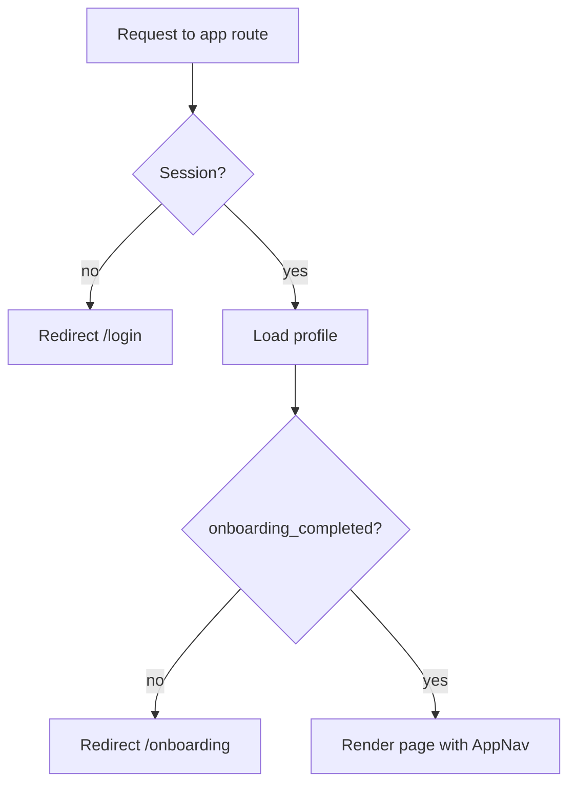

# TasteTailor MVP Implementation Plan

Source of truth: [PRD.md](./PRD.md), [ARCHITECTURE.md](./ARCHITECTURE.md), [TECHNICAL_DESIGN.md](./TECHNICAL_DESIGN.md).

Locked for this plan: Tailwind CSS, Supabase dashboard SQL editor for migrations, mock AI provider until OpenAI keys exist.

## Progress

| Phase | Status |
| --- | --- |
| 0 — Scaffold and tooling | Completed |
| 1 — Database | Completed |
| 2 — Supabase clients and auth | Completed |
| 3 — Onboarding and route gates | Pending |
| 4 — AI generation | Pending |
| 5 — Recipe detail | Pending |
| 6 — History and favorites | Pending |
| 7 — Shopping list and export | Pending |
| 8 — Polish and deploy | Pending |
| 9 — Tests, scale/security docs, presentation | Pending |

---

## Open dilemmas (decide as we go, not blocking Phase 0–1)

1. **PRD contradicts the technical design in two places.** PRD section 7 Flow 5 still promises cup-to-gram normalization, and Flow 2 still describes a curated categorized persona menu. We locked same-unit-only merging and free-text personas. The PRD is a partner document, so this needs a joint edit before submission.
2. **Rate-limit refund on upstream failure.** Design says a non-culinary refusal burns a generation slot. Undefined: what happens on an OpenAI 500 or timeout. Proposal: refund the slot on upstream/network failure, never on refusal.
3. **Supabase email confirmation.** Enabled by default, which blocks instant signup during a live demo. Proposal: disable confirmation for the MVP project and note it in the security document as a known gap.
4. **Fractional quantities for countable items.** Scaling 3 eggs from 4 to 6 servings gives 4.5 eggs. Proposal: round up to a whole number when the unit is empty (countable), keep 2 decimals otherwise.
5. **Insights content in scratch mode.** There is no original recipe to substitute from. Proposal: `substitutions` may be empty, `summary` explains the profile-driven choices instead.
6. **Recipe delete.** Listed as optional in the design. Proposal: include it; it is cheap and makes the CRUD story complete.
7. **Work split with your partner.** Affects branching. Proposal: short-lived feature branches off `main`, one phase per branch.

---

## Phase 0 — Scaffold and tooling

Create the Next.js app in the existing repo root (the folder already has `docs/` and `README.md`, so scaffold into a temp dir and move, or use `create-next-app .` with the existing-files prompt).

```bash
npx create-next-app@latest . --typescript --tailwind --eslint --app --src-dir=false --import-alias "@/*"
npm install @supabase/supabase-js @supabase/ssr zod openai
npm install -D vitest @vitejs/plugin-react
```

Files to add:

- `.env.local.example` — documents every variable, committed.
- `lib/constants.ts` — `DIET_TYPES`, `ALLERGY_OPTIONS`, `GOAL_OPTIONS`, `HISTORY_PAGE_SIZE`, `MIN_SERVINGS`, `MAX_SERVINGS`, `DEFAULT_GENERATIONS_PER_DAY`.
- `types/profile.ts`, `types/recipe.ts` — row shapes from technical design section 14.

**gitignore note:** Confirm `.env.local` is ignored before committing secrets. Keep `.env.local.example` commit-able via a `!.env*.example` exception.

---

## Phase 1 — Database

Create the Supabase project (free tier), then paste [the DDL from technical design section 4](./TECHNICAL_DESIGN.md) into the dashboard SQL editor. Commit the same SQL to `supabase/migrations/0001_init.sql` so the repo stays the source of truth.

Verification checklist after running:

- `profiles`, `recipes`, `shopping_list_items` exist with RLS enabled.
- Signing up a test user auto-creates a `profiles` row via the `handle_new_user` trigger.
- `claim_generation_slot(20)` returns `true` then `false` after the limit.
- Querying another user's recipe row returns zero rows, not an error.

---

## Phase 2 — Supabase clients and auth

```text
lib/supabase/client.ts     createBrowserClient()  -> for client components
lib/supabase/server.ts     createServerClient()   -> RSC + route handlers, cookie-aware
lib/supabase/middleware.ts updateSession(request) -> refresh cookies at the edge
middleware.ts              matcher for all non-static routes
```

Auth pages and forms:

- `app/(auth)/login/page.tsx` + `components/auth/LoginForm.tsx` — validate with `LoginSchema`, call `signInWithPassword`, show one generic error for bad credentials.
- `app/(auth)/signup/page.tsx` + `components/auth/SignupForm.tsx` — validate with `SignupSchema`, pass `display_name` in `options.data` so the trigger can read it.

Base UI primitives built here and reused everywhere: `Button`, `TextField`, `TextArea`, `Select`, `CheckboxGroup`, `Spinner`, `EmptyState`, `Toast`.

---

## Phase 3 — Onboarding and route gates

`app/(app)/layout.tsx` loads the session and profile once, then decides:



`components/onboarding/OnboardingForm.tsx`:

- Fields: display name, diet select, allergy checkboxes, goal checkboxes, notes.
- Validates `OnboardingSchema` (requires at least one meaningful preference).
- On submit: `update profiles set ..., onboarding_completed = true` then push to `/generate`.

`components/profile/ProfileForm.tsx` reuses the same field set with `ProfileUpdateSchema` and does not touch the onboarding flag.

Middleware stays cookie-only; the profile read happens in the layout to keep the edge light.

---

## Phase 4 — AI generation

Build the provider abstraction first so work is not blocked on the OpenAI key.

```text
lib/ai/schema.ts    AiRecipeOutputSchema, InsightsSchema
lib/ai/prompt.ts    buildSystemPrompt(), buildUserPrompt(profile, request)
lib/ai/provider.ts  interface RecipeProvider { generate(input): Promise<unknown> }
lib/ai/openai.ts    real provider, structured JSON output
lib/ai/mock.ts      deterministic fixture provider
```

Provider selection: `AI_PROVIDER=mock | openai` in env. Mock returns a valid fixture recipe, sets `persona_applied: false` for a sentinel persona string, and returns `refused: true` for a non-culinary keyword so guardrail handling is testable without spending tokens.

`app/api/generate/route.ts` logic, in order:

1. `getUser()` → 401
2. Load profile → 403 when `onboarding_completed` is false
3. `GenerateRequestSchema.safeParse(body)` → 400 with Zod issues
4. `claim_generation_slot(GENERATIONS_PER_DAY)` → 429
5. Build prompts, call provider
6. Parse with `AiRecipeOutputSchema`, one repair retry, then 422
7. `refused === true` → 400 `non_culinary`, no insert
8. `persona_fallback_used = Boolean(persona_query) && !persona_applied`
9. Insert into `recipes`, return 201 with the saved row

Generate UI:

- `components/generate/GenerateTabs.tsx` switches between the two forms.
- `AdaptRecipeForm` manages dynamic ingredient rows (`name | quantity | unit`) and step rows in local state.
- `ScratchDishForm` is a single dish-name field.
- `PersonaField` is a free-text input with `PERSONA_SHORTCUTS` chips that only prefill the field.
- On success, route to `/recipes/[id]`, showing the fallback banner when needed.

---

## Phase 5 — Recipe detail

```text
lib/shopping/scale.ts   scaleIngredients(ingredients, servingsBase, uiServings)
lib/format.ts           formatQuantity(n)  // 2.0 -> "2", 2.5 -> "2.5"
```

Scaling is pure and client-side: `quantity * uiServings / servingsBase`, never written back to the database. Countable-unit rounding follows dilemma 4.

`app/(app)/recipes/[id]/page.tsx` is a server component that loads the row (RLS makes a foreign id return not-found) and renders:

- `RecipeHeader` with title and `FavoriteButton` (optimistic `is_favorite` toggle)
- `ServingScaler` holding `uiServings` in local state, clamped to 1–24
- `IngredientList` recomputing display quantities on every change
- `StepList`
- `InsightsBox` with summary plus substitution reasons, and the persona fallback banner when applicable
- `AddToShoppingListButton` receiving the current `uiServings`

---

## Phase 6 — History and favorites

Both are server components over the same table:

```ts
// history
.from("recipes").select("id,title,created_at,is_favorite,mode")
  .order("created_at", { ascending: false })
  .range(from, from + HISTORY_PAGE_SIZE - 1)

// favorites: same query plus .eq("is_favorite", true)
```

Page state lives in the `?page=` search param so it survives refresh. `RecipeCard` is a link to the detail page. Empty states link to `/generate`.

---

## Phase 7 — Shopping list and export

```text
lib/shopping/merge.ts       normalizeName(), normalizeUnit(), mergeQuantity()
lib/shopping/exportText.ts  formatShoppingListForExport(items)
```

Add-to-list logic: scale to `uiServings`, normalize each ingredient, then upsert on the `(user_id, name, unit)` unique constraint, summing quantity on conflict and appending the recipe id to `source_recipe_ids`. Different units stay as separate rows by design.

`/shopping-list` renders checkbox rows with optimistic updates, a delete per row, a clear-all action, and `ExportListButton` which writes a two-section plain-text block to the clipboard:

```text
Shopping list - TasteTailor
To buy:
- 5 onion
- 3 cup flour
Already have:
- 2 eggs
```

---

## Phase 8 — Polish and deploy

- Loading and error boundaries per route group, consistent error copy from technical design section 10.
- Landing page with the value proposition and the two calls to action.
- Deploy: push to GitHub, import into Vercel, set env vars (`NEXT_PUBLIC_SUPABASE_URL`, `NEXT_PUBLIC_SUPABASE_ANON_KEY`, `OPENAI_API_KEY`, `OPENAI_MODEL`, `AI_PROVIDER=openai`, `GENERATIONS_PER_DAY`), add the Vercel URL to Supabase Auth redirect URLs.
- Smoke test the full flow on the live URL.
- Update `README.md` with local run instructions and the env var table (course deliverable).

---

## Phase 9 — Remaining course deliverables

Written after the app works, in this order: test specification document, implemented tests (Vitest for `merge`, `scale`, validation schemas, and the generate route with the mock provider, plus one Playwright end-to-end run of signup through export), scale document, security document, and the 10–15 minute presentation.

---

## Suggested branch flow

One branch per phase off `main`, for example `feat/phase-2-auth`, merged after a quick review by whichever partner did not write it. Keeps the shared history readable and gives both partners exposure to the whole codebase, which matters for the oral presentation.
